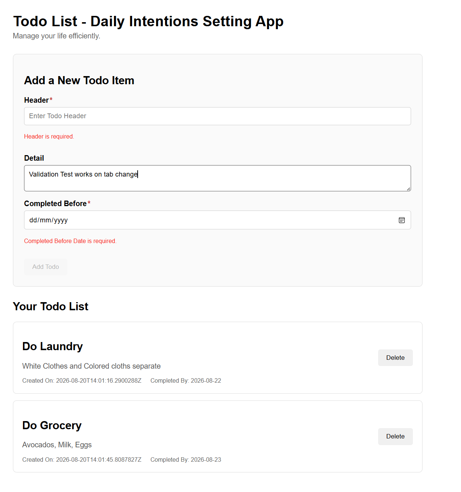

# TodoListClient



This project was generated using [Angular CLI](https://github.com/angular/angular-cli) version 22.1.4.


## Ennvironment Settings
Backend project needs to be running before we start Client, note down the backednd URL.

Environment specific settings are added under environments\environment.ts. Currently it reflects the backend URL to connect 

```Typescript
export const environment = {
    apiUrl: 'https://localhost:7256'
};

```


## Building

To build the project run:

```bash
npm install
ng build
```

This will compile your project and store the build artifacts in the `dist/` directory. By default, the production build optimizes your application for performance and speed.

## Running unit tests

To execute unit tests with the [Vitest](https://vitest.dev/) test runner, use the following command:

```bash
ng test
```


## Test Coverage 

To execute test coverage, use the following command:

```bash
ng test --coverage
```

```
 % Coverage report from v8
---------------------------------|---------|----------|---------|---------|-------------------
File                             | % Stmts | % Branch | % Funcs | % Lines | Uncovered Line #s 
---------------------------------|---------|----------|---------|---------|-------------------
All files                        |   89.65 |    96.77 |      80 |    86.3 |                   
 app                             |     100 |      100 |     100 |     100 |                   
  app.html                       |     100 |      100 |     100 |     100 |                   
  app.ts                         |     100 |      100 |     100 |     100 |                   
 app/features/todoList           |   88.88 |      100 |      75 |   85.71 |                   
  todo-item.service.ts           |   88.88 |      100 |      75 |   85.71 | 20                
 app/features/todoList/todo-list |   88.88 |    93.75 |      80 |   85.48 |                   
  todo-list.html                 |   91.78 |      100 |     100 |   90.69 | 16-17,32-33       
  todo-list.ts                   |   80.76 |    91.66 |   76.92 |   73.68 | 36,45-46,58,73    
 environments                    |     100 |      100 |     100 |     100 |                   
  environment.ts                 |     100 |      100 |     100 |     100 |                   
---------------------------------|---------|----------|---------|---------|-------------------

```

## Development server

To start a local development server, run:

```bash
ng serve
```

Once the server is running, open your browser and navigate to `http://localhost:4200/`. The application will automatically reload whenever you modify any of the source files.


## Styling Decision and References

Styling is intentionally minimal using HTML and CSS.

Angular Material would be a strong choice for a production application, but for this exercise it would add additional surface area without demonstrating functionality that is central to the assessment.

## Development Approach

I developed the project using Visual Studio Code and made use of the editor's built-in IntelliSense and code completion features. These suggestions helped with syntax and common coding patterns while developing the application.

I reviewed and adapted the suggested code to suit the application's requirements rather than treating the suggestions as final implementation. I also validated the implementation through the application's unit and integration tests and by testing the API through the .http file.
